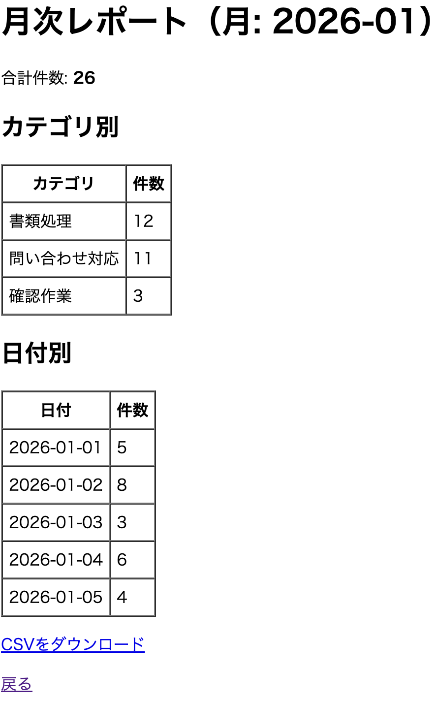

# monthly_report_tool（CSV月次レポート自動作成ツール）

CSVデータをもとに、月次の業務レポートを自動生成するツールです。  
Python / SQLite / Flask を使用し、CLI・SQL・Webの3段階でデータ集計と可視化を行います。

---

## 機能

### CLI版
- 合計件数の算出
- カテゴリ別集計
- 日付別集計
- 月指定（YYYY-MM）
- CSVレポート出力

### SQLite版
- CSV → SQLiteへデータ取り込み
- SQLでの集計処理
- SQLレポートCSV出力

### Web版（Flask）
- 月選択（プルダウン）
- ブラウザで集計表示
- CSVダウンロード
- シンプルなUIで操作可能

---

## ディレクトリ構成


monthly_report_tool/
├─ data/
│ ├─ report_sample.csv
│ └─ report.db
├─ src/
│ ├─ app.py
│ ├─ import_sqlite.py
│ ├─ report_sql.py
│ └─ web_app.py
├─ out/
├─ .gitignore
└─ README.md


---

## セットアップ

```bash
cd ~/monthly_report_tool
python3 -m venv .venv
source .venv/bin/activate
pip install flask
CLI版の使い方
集計表示
python src/app.py --input data/report_sample.csv --month 2026-01
CSV出力
python src/app.py --input data/report_sample.csv --month 2026-01 --out out/report_2026-01.csv
SQLite版の使い方
CSVをDBへ取り込み
python src/import_sqlite.py --input data/report_sample.csv --db data/report.db
SQL集計
python src/report_sql.py --db data/report.db --month 2026-01
SQLレポートCSV出力
python src/report_sql.py --db data/report.db --month 2026-01 --out out/sql_report_2026-01.csv
Web版（Flask）
起動
python src/import_sqlite.py --input data/report_sample.csv --db data/report.db
python src/web_app.py
アクセス

http://127.0.0.1:5002/

## スクリーンショット

### トップ画面


### レポート画面


入力CSV形式
date,category,count,memo
2026-01-01,問い合わせ対応,5,朝対応
2026-01-02,書類処理,8,月初処理
2026-01-03,確認作業,3,再確認あり
工夫した点

CLI → SQLite → Web と段階的に機能拡張

業務で使える「月次レポート」を意識した設計

CSVダウンロード機能で実用性を強化

入力ミスを防ぐ月プルダウンを実装

コードの再利用性を意識した構造

今後の改善

グラフ表示（可視化）

カテゴリ別ランキング

UIデザイン改善

アクセシビリティ強化

テストコード追加

作者

Yasutomo888